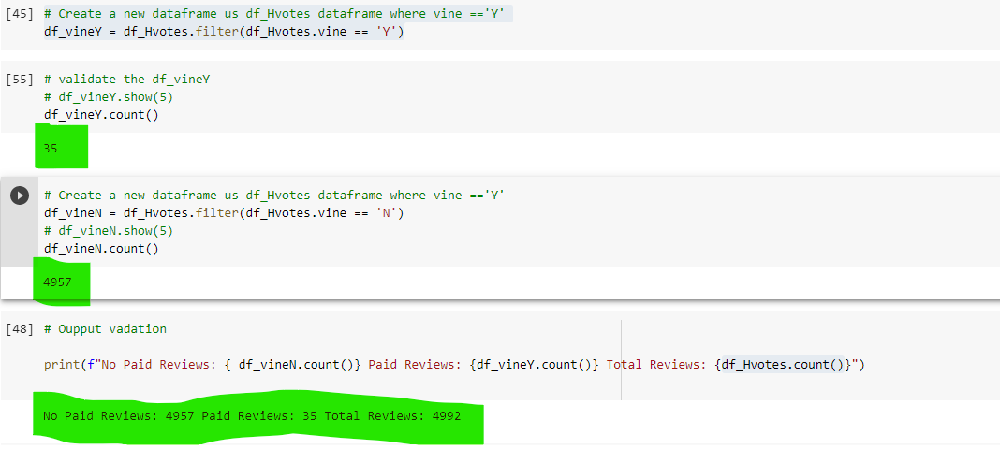

# Amazon_Vine_Analysis
## Overview
Amazon Vine program analysis is a designed to determines if there is a bias toward favorable reviews from Vine members.
The analysis uses PySpark to perform the ETL process to extract the dataset, transform the data, connect to an AWS RDS instance, load the transformed data into pgAdmin and calculate different metrics.
This project focused on the US major appliance data reviews.

## Resources Used 
* **Source Data:** Amazon review dataset (US major applicance)
* **Tools:** Google Colab Notebook, PostgresSQL, pgAdmin and AWS

## Results:
* **Total Paid Review Vs Unppaid Reviews** - The dataframes filtered for Vine == 'Y' & Vine = 'N'

* **5-start rates total paid reviews Vs total unpaid reviews** - This is the count derived from paid and unpaid dataframes with a filter applied on start_results >= 5

 <table>
 <tr>   
   <td align="center"> <b> Total Paid 5-Start Reviews </b> </td>
   <td align="center"> <b> Total Unpiad 5-Star Reviews </b></td>
  </tr> 
  <tr>   
    <td valign="top">  </td>
    <td valign="top">  </td>
  </tr>     
</Table> 

* **5-start rating percentage(paid reviews Vs total unpaid reviews)** - Calulated the percentage to determine the bias on reviews among paid and unpaid subscribers. 

<table>
 <tr>   
   <td align="center"> <b> Percentage of Paid 5-Start Reviews </b> </td>
   <td align="center"> <b> Percentage of Unpiad 5-Star Reviews </b></td>
  </tr> 
  <tr>   
    <td valign="top">  </td>
    <td valign="top">  </td>
  </tr>     
</Table>

## Summary

